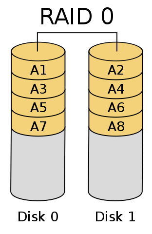
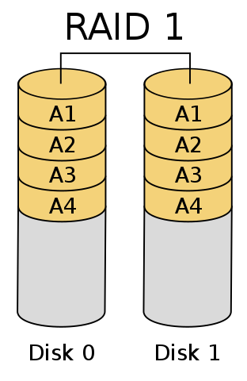
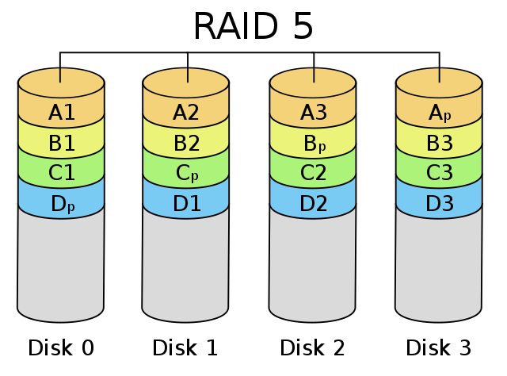
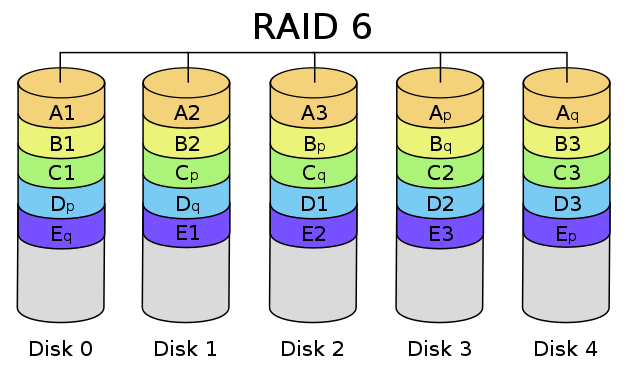

# Managing Storage

## LVM

* Logical Volume Management
* Pooling multiple storage devices as a single logical volume.
* lvm2 tools : create and manage virtual block devices from physical devices.

## RAID

* Redundant Array of Independent (or Inexpensive) Disks
* Distributing data over multiple disks for redundancy / speed / increased capacity
* Raid Controller : software or hardware

### RAID modes

usable capacity < actual capacity (when not striping)

| RAID Mode    | Min Drives    | Description    | Comments    |
|:--------------: | :-------------: | :-------------- | :-------------- |
| RAID 0    | 1    | Striping | Speed up |
| RAID 1    | 2   | Mirroring | Read is n times faster, n-1 drive failures tolerated |
| RAID 5   |  3 | Block-level striping with distributed parity   |  1 drive failure tolerated, Read is n times faster, write is n-1 times faster |
| RAID 6   | 4 | Block-level striping with dual distributed parity | 2 drive failures t lerated, read is n times faster, write is n-2 times faster |

RAID 0



RAID 1



RAID 5



RAID 6



* Imgage source : Wikipedia
# Networking Commands and SSH

Accessing remote machines on command line

<!-- 
Explaination of Network private , public
Routing
Types of Network
Network classes or IP address range
Ports, routing
-->

## Ways to gain remote access

* VPN access
* ssh tunneling
* Remote desktop : x2go, rdp, pcoip,
* Desktop over browser: Apache Guacomole
* Commercial, over internet : Teamviewer, AnyDesk, Zoho assist, ...

## Some important ports

| port | service | description |
| :--- | :------ | :---------- |
| 21 | ftp | File transfer |
| 22 | ssh |Secure Shell |
| 25 | smtp | Simple Mail Transfer Protocol |
| 80 | http | Hypertext Tranfer Protocol |
| 443 | https | Secure Hypertext Tranfer Protocol |
| 631 | cups | Common Unix Printing System |
| 3306 | mysql | MySQL database |

## Firewall

* [` ufw `]
* Ports open on my machine
* Ports needed to be accessed on remote machine
* Network routing over the port
* Firewall controls at each hop

## Protecting a server

A server with a public service is protected from anonymous user using using Web Application Filter and Network Firewall.

## SElinux

* Security Enhanced Linux mode available on Ubuntu too, apart from server grade flavors like CentOS, Fedora, RHEL, SuSE Linux etc.,
* Additional layer of access control on files to services
* Role Based Access Control
* Process sandboxing, least privilege access for subjects
* Check using ` ls -lZ ` and ` ps -eZ `
* RBAC items: user (**unconfined_u**), role (**object_r**), type (**user_home_t**), level (**s0**)
* Modes: **disabled**, **enforcing**, **permissive**
* Tools: ` semanage `, ` restorecon `

SELinux is recommended for all publicly visible servers

## Network tools

| tool   | Description    |
| :---------------: | :--------------- |
| ` ping ` | To see if the remote machine is up |
| ` traceroute ` | Diagnostics the hop timings to the remote machine |
| ` nslookup ` | Ask for conversion of IP address to name |
| ` dig `  | DNS lookup utility |
| ` netstat ` | Print network connections |
| mxtoolbox.com | For help with accessibility from public network |
| whois lookup | Who owns which domain name |
| ` nmap ` | (careful !) Network port scanner |
| ` wireshark ` | (careful !) Network protocol analyzer |

## High Performance Computing

* Look at [www.top500.org](www.top500.org) for statistics
* Accessing a remote HPC machine is usually over SSH
* Long duration jobs are submitted to a job scheduler for execution
* Raw data if large needs to be processed remotely before being transferred to your machine (network charges? bandwidth?)
* Comfort with command line is a must

## [` ifconfig `](/Week-6/Lecture1.md#ifconfig)

## ` nslookup `

* Convert names to IP addresses.

Syntax:

```
nslookup <domain-name>
```
Example:

```bash
nslookup www.iitm.ac.in
```
  - Try for www.mit.edu & aqua.iitm.ac.in

The same information can be obtained from https://mxtoolbox.com/.

## ` dig `
* ` dig ` is a DNS lookup utility.
* It can show the IP address of a domain name or can reverse lookup the domain name of the IP address.

Syntax:

1. dig for the IP address using domain name

```
dig <domain-name>
```


2. dig for the domain name using IP address.

```syntax
dig -x <IP-address>
```

Example:

```bash
dig www.google.com # 1
```

```bash
dig -x 54.209.123.136 # 2
```

* Getting only the DNS of the IP address by suppressing all other output

```terminal
~$ dig +noall +answer -x 34.234.167.93
```

## ` w `
* See the people who are currently logged into the system

## ` qstat `
* Job scheduler especially used in High Performance Computing.
* Lists job id, job name, user, time, Q( in queue) / R (running), type of Q  (CPU, GPU)

```bash
qstat
```

## ` ping `

* It is used to check if a particular host or IP address is reachable.

```
ping <host or IP address>
```

Example:

```bash
ping 170.187.251.202 # VM used for se2001 
```

## ` netstat `

* It is a command used to show network statistics and lists the active Internet Connections and Active UNIX domain sockets.

```bash
netstat
```
# Git

Git is a version control system.

The git enabled directories are called repositories.

## Installing Git

```terminal
~$ sudo apt-get install git
```

## Configuring Git

Git global configuration is applicable for all directories.

To see the global configuration use the command below,

```bash
git config --global --list
```

To see the local configuration remove the ` --global ` from the command above.

Now we will set up the global configuration.

To set the username use the command below.

```bash
git config --global user.name <your-name>
```

To set the user email use the command below.

```bash
git config --global user.email <your-email> 
```

To set the email and name only for a particular repository remove ` --global ` option from the commands above and run them.

Here, you are almost done with the configuration. We will look it later if some more configurations needed.

## Creating a git repository

You can create (initiate) a repository by being in an already available directory or create a new one giving option to ` git init `.

We will go by the first way.

```terminal
~$ mkdir myrepo
~$ cd myrepo
~$ git init  
```

This will initialize an empty repository.

You can create a file within ~/myrepo. Write Hello World! program in any language of your choice with name ` hello.<ext> `

I will use python. 
It's great that I have it already.

```terminal
~/myrepo$ cat hello.py
print("Hello World!")
```

## Status of a repository

You have created a file. Now you can check status of the repository. 

It shows the created, modified or deleted files.

Git is so friendly that it also shows you what to do.

Run the command below

```terminal
~/myrepo$ git status
```

Observe, what you see?

```terminal
No commits
Untracked files ...
```

You have created a file but it is untracked and now note that any newly created file needs to be tracked before commit.

What is commit?

It is an action which takes account of the changes and adds them to the git storage.

## Tracking a newly created file

` git add ` is used to track newly created files.

Let's track the file we have created.

```terminal
~/myrepo$ git add hello.py
```

Now what you observe when you check status?

```terminal
Changes need to be committed:
...
```

So now we will see how to commit changes.

## Committing the changes

We use syntax below to commit any changes which are recently tracked or staged(?) using add.

Let's commit the changes on ` hello.py `, and later diagnose what it means.

```terminal
~/myrepo$ git commit -m "hello world program created"
```

Here you see, we are using ` git commit ` with option ` -m ` which stands for message that should (not always) contain how you want to remember the commit.

Each commit gets a unique commit id so that the changes at that particular instant of commit are remembered.

Now check the status once again.

Observe the output.

You are doing well. Now we will modify the ` hello.py ` file.

```terminal
~/myrepo$ cat hello.py
print("Hello World!")
print("Welcome!!!")
```

Check the status. What you see?

You have modified the file, and your changes needs to be staged before commit.
As a suggestion, you can see the commands you have to use for staging or discarding the changes.

Use the first suggested command, and we will use it as below.

```terminal
~/myrepo$ git add hello.py
```

Now check the status and commit the changes with message *file modified*.

You can add all files and commit using one line command

## Adding and committing simultaneously

```terminal
~/myrepo$ git commit -a -m "files created and modified"
```

To undo changes if any you can use the command below,

## Restoring changes made in a file

* Restoring a modified file before adding to the staging area

```bash
git restore <file>
```
Note: All changes made after the recent commit will be lost.

* Restoring a modified file after adding to the staging area

```bash
git restore --staged <file>
```

All along we are following blindly and we don't know where we are!

## Checking where we are?

Git uses concept of branching to keep track of the location.

Multiple branches can be created and the files in those branches are modified without affecting other branches.

This is the branch structure that git tree follows to survive over the ages!

All along you are seeing something as the first line,

```terminal
On branch master
...
```

Yes, git on it's own creates a branch called *master* by default. This name can be modified.

Using git status you can see on which branch you are.

There is other elegant way to figure this out,

## Branching in git

To know what all branches are there and on which branch you are use the command below

```terminal
~/myrepo$ git branch
```

Currently, we have only one branch, i.e. *master* and the * in front of it indicates we are on this branch.

Can we create a branch? Of course, git is not restricting us from anything.

Let's do it!

## Creating a branch

We use the same command we used to see the branches, but with an argument which is a new branch name of your choice. My choice is *main*.

```terminal
~/myrepo$ git branch main # main is the name of the branch that will be created
```

You nailed it, now see what all branches are there.

You can notice that two branches are listed in the output in alphabetical order.

But, you are still on the branch *master*.

How to jump to new branch *main*?

### Checkout to a branch

There are two options to git that you can use to jump to a branch, ` checkout ` and ` switch `.

```terminal
~/myrepo$ git checkout main
```

Check the status to see where you are. Of course you will be on branch *main*.

Since, you landed on *main* from *master*, you will see all the files from *master* into *main*. 

But, if you create files in *main* the same will not happen once you jump to *master*.

In branch *main* you can create files and use the git commands you have learned to save the changes.

I suppose that you might have created some fancy program, let's say *add.py* to perform addition of two numbers.

Now go to *master* branch and run ` ls `. You see that only one file is there which is *hello.py*

Now how will you merge whatever you have done on *main* branch into *master* branch?

## Merging branches in git

Git is not limited to just separation of concerns but also helps putting it together when it is resolved.

```terminal
~/myrepo$ git merge main
```

Now you will see the files on *main* merged to *master*.

What's next?

We may want to see what all commits we have done.

Thanks to git. It's logging feature comes to our rescue.

Let's explore it!

## Logging in git

To see full log in git run the command below

```terminal
~/myrepo$ git log
```

What do you see?

Line 1 : Commit id (also knows as commit SHA or commit hash) and the branch name.

Line 2 : Author name and email id of the author of the commit.

Line 3 : Timestamp on which the commit took place.

Line 4- : The commit message. It may span multiple lines.

And the above 4 lines repeated.

The most recent commit you see on the top. And then commit before it, and so on...

Here, you see only two commits which may not be the case when you are working with large project.

Is there any way to make the log line short?

Yes. To see commits on single line just add ` --oneline ` to ` git log `

```terminal
~/myrepo$ git log --oneline 
```

Now you can see oneline log.

Why this is helpful?

It is helpful when you want to checkout to your previous commits or see the changes you have made using diff.


## Checkout to a commit HASH

I assume that you have played around with git by adding many more files and committing those so and your log is now grown.

To check out to a commit hash ` 206a535 `

```terminal
~/myrepo$ git checkout 206a535
```

Checkout to your *master* branch

Now we will move on to see how to perform diff using git.

## Git diff to know the changes

```terminal
~/myrepo$ git diff main 
```

This command prints the diff between *master* and *main*.

Take the help of internet to know how to interpret the output.

Now we are done with most of the important commands (there are more, but we will not discuss that here, please explore in the [resources](#resources) given below.

We will now discuss how to work with remote repositories.

## Working with remote repositories

### Git repository hosting services

* [GitHub](www.github.com)
* [GitLab](www.gitlab.com)
* BitBucket
* CloudForge

The repository hosting services provide centralized location to host your repository.

We will go with [Github](www.github.com) as it is most popular website for housing Open Source Software.


Before we proceed create an account on Github.

Follow the steps given in below

### Create an account

1. Go to [www.github.com](www.github.com)
2. On top right corner you will see Sign up and **Sign in** option.
3. If you already have an account proceed with **Sign in**.
4. If you don't have an account click on **Sign up**. 
5. Follow the steps suggested on the Sign up page.
6. After you verify your email you will be redirected to your dashboard on github.
7. On top-right corner on dashboard click on Avatar and got to **settings**.
8. Go to section **SSH and GPG Keys**
9. Click the button **New SSH key**

### Generate SSH key

10. Now open terminal on your machine.
11. Type command ` ssh-keygen ` and follow the prompts. Write no if the keys are already available.
12. Now you have successfully created the SSH keys.

### Add SSH key to GitHub

13. Now copy the contents of the file ` ~/.ssh/id_rsa.pub ` and paste it in the **key** text area on page that you opened in step 9.
14. Give it a name in **Title** input field.
15. Keep default **Key Type** then click on **Add SSH key**.

### Create a repository in GitHub

15. Go to dashboard and click on Repositories section. Then click on **New**
16. Select owner from dropdown and give repository name.
17. For now keep all other options default and checkboxes unchecked, click on **Create repository**, you will be redirected to a new page.
18. Click on **SSH** and copy a link similar to ` git@github.com:prassr/myrepo.git `.
19. Open terminal and go to ` ~/myrepo/ `, which is a git repository you are working on.

### Adding a remote repository to an existing repository

We are going to use the same commands listed on page in step 18.

20. Run command below to add remote repository to existing repository

```bash
git remote add origin git@github.com:prassr/myrepo.git # origin is alias to your remote repository on your machine
```

Since, git by default creates branch with name *master* and GitHub with name *main*. 

You may want to change the name of your *master* branch to *main* and *main* to *master*. This you will find as easy as variable value swapping!

Or push the *main* branch by switching to it.

To change the name of a branch add ` -m ` option to ` git branch <new-name> `

I have already done the changes, so once you are done follow next step.

21. Run the command below to push changes to remote repository.

```bash
git push --set-upstream origin main # push main to origin
# git push  ## use for later pushes
```

` --set-upstream ` is required only during first push of a branch to remote repository.

Hurrah!!! Here you have learned how to add remote repository to local repository and push the changes from local repository to remote repository.

Now we will see how to clone a repository.

## Cloning a repository

Follow steps 15 to 17 to create a remote repository from section above. This time check the **Add README** checkbox.

On similar lines of step 18 copy the SSH link by clicking on **Code** button.

1. Open terminal and run the command below.

```bash
git clone git@github.com:prassr/myproject.git # local repository name will be myproject
```

You have successfully cloned a remote repository.

You can modify the README.md and push it to remote repository by following the step 21 in above section.

Now go to GitHub and make changes to README.md file and commit it there itself.

You may now want to pull the remote changes to your local repository.

## Pulling changes from remote repository

You can pull the changes from remote repository using the command below,

```bash
git pull
```

That's all! Now you can see the changes to README.md file locally.

Still want to explore more?

Here are the

# Resources

* [Pro Git](https://git-scm.com/book/en/v2)
